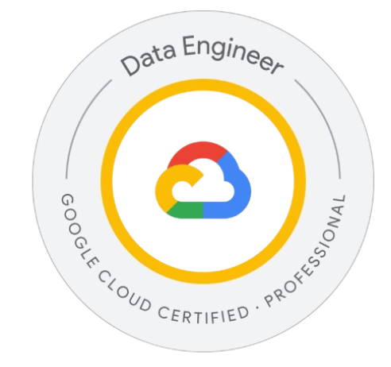

# 👋 Hi I'm Rutuja Chauhan!

I bring extensive expertise as an AI and Data Engineer, specializing in converting data into actionable insights. Expertise in Large Language Models (LLMs), Gemini, Vertex AI, Hugging Face, Nano Banana, and Veo models. Strong background in batch processing pipelines, large-scale data processing, workflow optimization, and scalable Google Cloud architectures, delivering significant performance and time improvements.

***

## 📝 Skills

💻 Programming: Python, SQL

☁️ Cloud Platforms: Azure & Google Cloud Services.

🔍 Visualization: Power BI, Looker Studio, Appache SuperSet

📈 Analysis: Statistics, Machine Learning

🤖 Generative AI: Vertex AI (Google gemini-vision pro, Nano Banana, VEO, PALM2 etc., Autogen and agents)

## 💼Professional Experience:

Data Engineering:

Utilized a diverse set of tools and skills within Microsoft Azure Stack (Python, SQL, Azure Data Factory, Azure Blob Storage, Azure Datalake, Databricks) and Google Cloud Stack (Storage Bucket, Cloud Dataflow, Cloud Functions, BigQuery, Vertex AI, Cloud Built) to orchestrate seamless data flows, connecting operational systems. Ensured accessibility for analytics and business intelligence applications by transforming raw data into actionable insights through adept utilization of Google Cloud and Microsoft Azure technologies.

Championed the delivery of the strategic data vision, fostering networks to share insights and best practices. Demonstrated advanced skills in data quality, cleansing, and validation, ensuring the unassailable integrity of the data. Contributed to the development of robust data engineering frameworks, advocating best practices to enhance the availability, security, and performance of data assets.

Built Data Engineering pipelines using Azure Data Factory and/or Azure Synapse and Azure Databricks. Collaborated effectively with cross-functional teams, including IT and business units, to ensure alignment and success of data-related initiatives.

Generative AI:

Designed and implemented Generative AI solutions using Python, OpenCV, Tesseract, EasyOCR, and Vertex AI models (Gemini, Imagen, Flash) for multimodal data processing.
Built an AI-driven resume evaluation system that generated candidate ratings and concise summaries by matching resumes against job descriptions, improving screening efficiency and consistency.
Developed an image-based receipt processing pipeline to extract structured transaction data in JSON format from diverse receipt formats, enabling downstream analytics and reporting.
Created an Audio-to-Visual Content Synthesizer using Gemini and Imagen 3 on Vertex AI, reducing content creation effort from a 3-person, 5-day process to a 15-minute automated workflow handled by a single user.
Developed an end-to-end GenAI agent solution for e-commerce leveraging the Nano Banana model to perform image generation and intelligent image editing based on dynamic user requirements.

Data Analysis:

Applied Python, SQL, Power BI, Looker Studio, and BigQuery in conducting comprehensive data analysis. Extracted insights from complex data sets to generate actionable recommendations. Executed Statistical Analysis and Exploratory Data Analysis to gain insights and identify patterns, trends, and outliers.

Created and maintained dashboards and reports using Power BI and Google Data Studio, providing stakeholders with easy-to-understand insights into key business metrics. Effectively presented data insights, technical documentation, and recommendations to key stakeholders, including executives and department heads, using Microsoft PowerPoint and Word.

***

<h3 style="text-align:center;"> 📜 Certificates

    
    
    
    
    

*** 

<h3 style="text-align:center;"> 🏅 Badges

    
    

*** 

<h3 style="text-align:center;">  🤝 Connect with me

    
    
    

